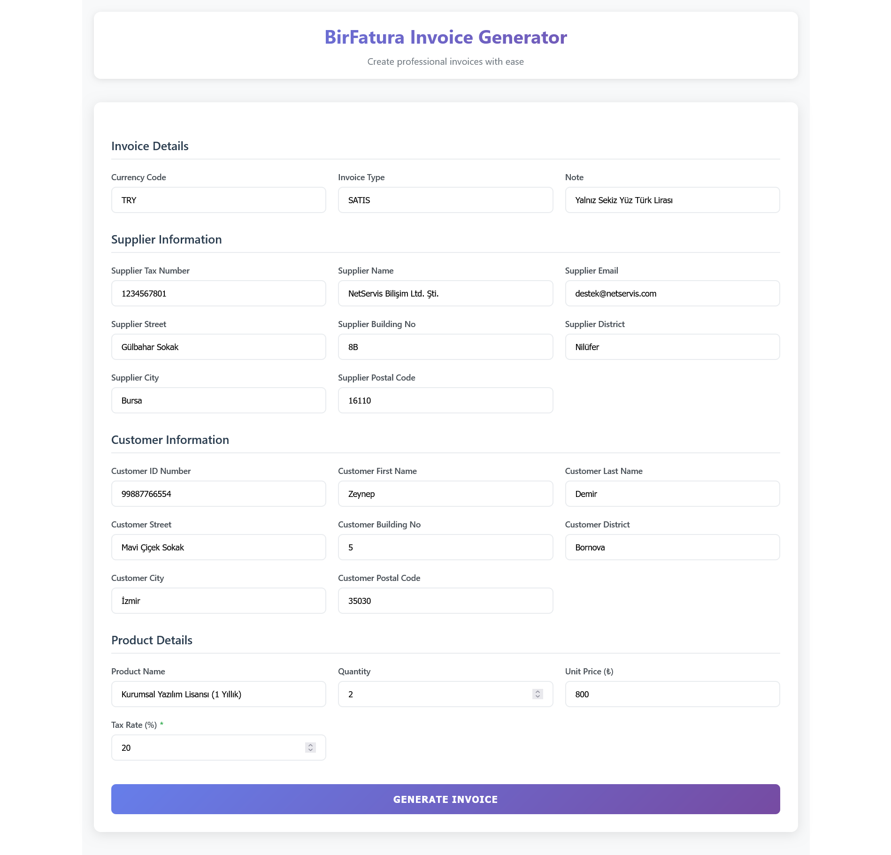
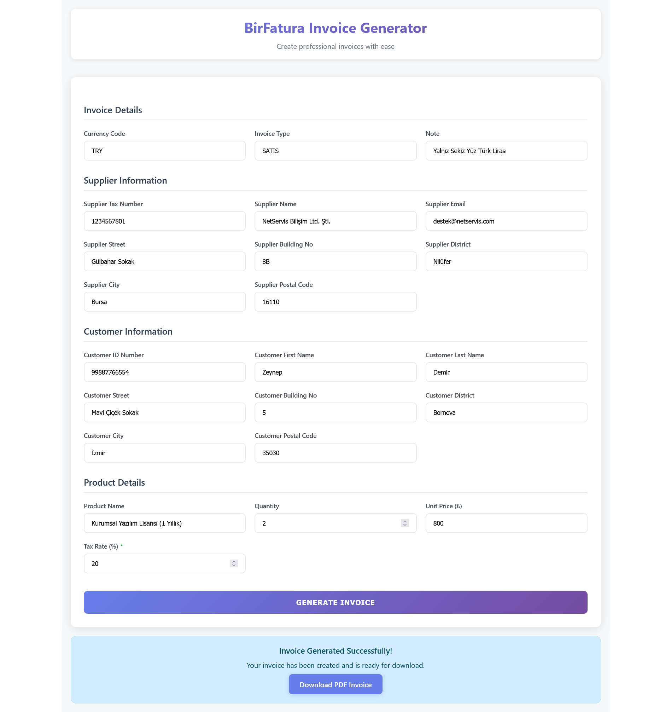
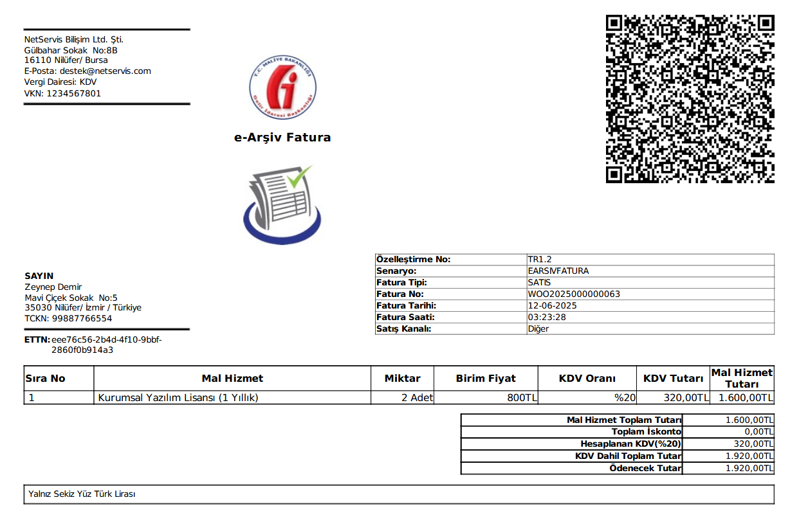

# BirFatura Invoice Integration

This project, developed using Java Spring Boot and React, sends e-Invoices via the BirFatura API. It generates UBL-formatted invoice XML from user input, compresses it into a ZIP archive, converts it to base64 format, and sends it to the server. After successful submission, the user receives a link to the invoice PDF.


## Features

- Collecting invoice data from the user (React frontend)
- Generating UBL-TR compliant XML invoices (Spring Boot backend)
- ZIP and Base64 encoding operations
- Sending e-Invoices via the BirFatura API
- Displaying the invoice PDF link after successful submission for download


## Technologies Used

### Backend
- **Java 21**
- **Spring Boot** – Backend application framework
- **JAXB (Jakarta XML Binding)** – Generating UBL XML files from Java objects
- **Jackson** – JSON serialization and deserialization
- **SpringDoc OpenAPI** – Swagger UI integration for API documentation
- **Maven** – Build and dependency management

### Frontend
- **React 19** – Frontend UI library

### Testing
- **JUnit 5** – Unit testing for backend logic

### Other
- **UBL 2.1 XML** – Standard format for e-Invoice generation
- **ZIP & Base64** – Compression and encoding for payload delivery


## Screenshots


### Invoice Creation Form


### Submission Success


### Example Invoice



## How to Run

1. **Clone the repository:**

   ```bash
   git clone https://github.com/mustafa-gunaltay/this-repo.git
   cd this-repo
   ```

2. **Backend Setup (Spring Boot):**

   - Navigate to the `BirFaturaInvoiceIntegration` directory.
   - Open the `application.properties` file.
   - Fill in your `API Key`, `Secret Key`, and `Integration Key` values provided by BirFatura.
   - Build and run the Spring Boot application.

   > **Note:** The project already contains a production build of the React app under `src/main/resources/static`.  
   > If you wish to customize the UI, you can do so from the **Frontend Setup (React)** section below and rebuild the frontend accordingly.

3. **Frontend Setup (React):**

   - Navigate to the `birfatura-frontend` directory.
   - Start the React development server using:

     ```bash
     npm start
     ```

   - Make any UI changes as needed. Thanks to React's hot-reloading feature, updates will instantly reflect in the browser.
   > **Note:** Make sure your backend is running on `http://localhost:8080` while making changes.

   - Once you are satisfied with the changes, generate a production build using:

     ```bash
     npm run build
     ```

   - This will create an optimized build in the `build/` directory.
   - Copy the contents of the `build/` folder into the `backend/src/main/resources/static/` directory to apply the new UI to the Spring Boot application.
   - Finally, run the Spring Boot backend to serve the updated UI along with the API.


## Important Note
This project uses the BirFatura API for integration testing purposes only. 
It does not include or redistribute any proprietary content or functionality of the BirFatura platform. 
Please refer to BirFatura's terms of service before using this integration in production.

